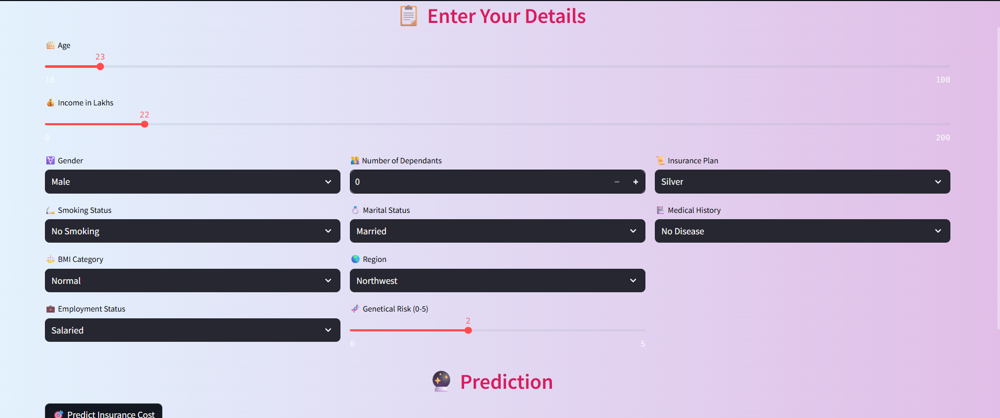

# 🛡️ Insurance Premium Price Prediction 💸  

## 📌 Project Overview

This project focuses on predicting health insurance premium prices using Machine Learning. The unique aspect of this project is the segmentation based on age:

- 🔹 For users **below 25 years**, predictions are done using **Linear Regression** for simplicity and interpretability.
- 🔹 For users **25 and above**, **XGBoost Regressor** is used to handle complexity and improve prediction accuracy.

A **Streamlit web app** has been developed for user-friendly interaction where individuals can input their details and get real-time premium predictions.

---

### 🧩 Problem Statement

Health insurance premiums vary significantly based on personal, lifestyle, and regional factors. However, many individuals—especially younger people—face unpredictable or inaccurate premium estimations due to generalized pricing models. This leads to confusion, misaligned expectations, and sometimes, poor financial planning.

The goal of this project is to develop a machine learning-based system that accurately predicts health insurance premiums using user-specific data. Recognizing that prediction accuracy varies significantly with age, the system implements a **dual-model approach**:

- For individuals **below 25 years**, use **Linear Regression** to maintain interpretability while minimizing overfitting.
- For individuals **25 years and above**, use **XGBoost Regressor** to handle complex, nonlinear relationships more effectively.

This tailored model strategy is deployed through a **Streamlit web app**, allowing users to interactively enter their data and receive instant, age-appropriate premium estimates.

---

## 🎯 Objective

To build a robust and easy-to-use tool that helps:

- Individuals understand and estimate their expected insurance premium.
- Insurance companies create age-personalized premium estimation models.
- Raise awareness of how personal health and lifestyle factors impact premium costs.

---

## 🔍 Features

- 🔢 **Dual Model Approach** based on Age:  
  - `Linear Regression` for Age < 25  
  - `XGBoost` for Age ≥ 25  
  This handles prediction inaccuracies found in younger age groups.
  
- 📊 **Streamlit Web App** for real-time interaction.

- 🧠 **Model Evaluation Metrics** like MAE, RMSE, and R² Score are logged for transparency.

- 🎨 Sleek and aesthetic UI (as seen in the attached image) with sliders and dropdowns for an intuitive experience.

---

## 🧬 Dataset Details

The dataset contains the following features:

- Age  
- Gender  
- Income  
- Number of Dependents  
- Insurance Plan (Bronze/Silver/Gold/)  
- Smoking Status  
- BMI Category  
- Employment Status  
- Marital Status  
- Region  
- Genetic Risk (0–5)  
- Medical History  

**Target Variable:** Insurance Premium Price

---

## 🚀 How It Works

1. User enters personal and lifestyle details via Streamlit interface.
2. Based on age, the app automatically selects the appropriate ML model.
3. The predicted premium is displayed instantly.

---

## 💡 Why This Matters

🎯 This project can:
- Help users **budget better** by getting an idea of their expected premiums.
- Aid **young individuals** (below 25) in understanding how lifestyle choices affect premiums.
- Support **insurance providers** in adopting age-specific strategies for better pricing.

---

## 🛠️ Tech Stack

- Python  
- Pandas, NumPy  
- Scikit-learn  
- XGBoost  
- Streamlit  
- Matplotlib / Seaborn (for EDA)

---
## 📸 Streamlit UI

